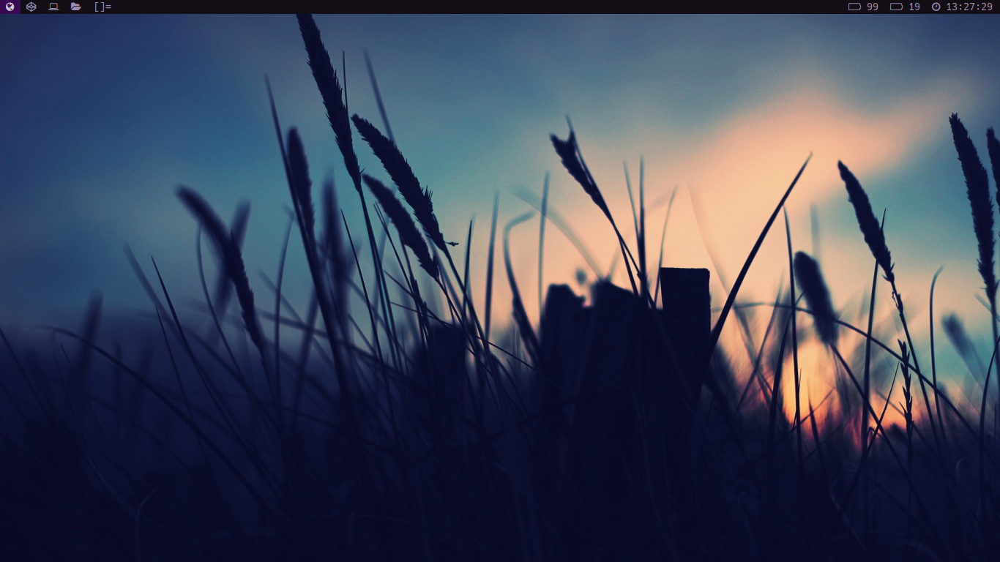

## My custom build of dwm, dmenu, slock, slstatus

### Key bindings

 - Super + Return    : Open Terminal
 - Super + Shift + q : Close window
 - Super + Shift + h : Hide window
 - Super + 1 - 4     : Switch tags

### Screenshot
