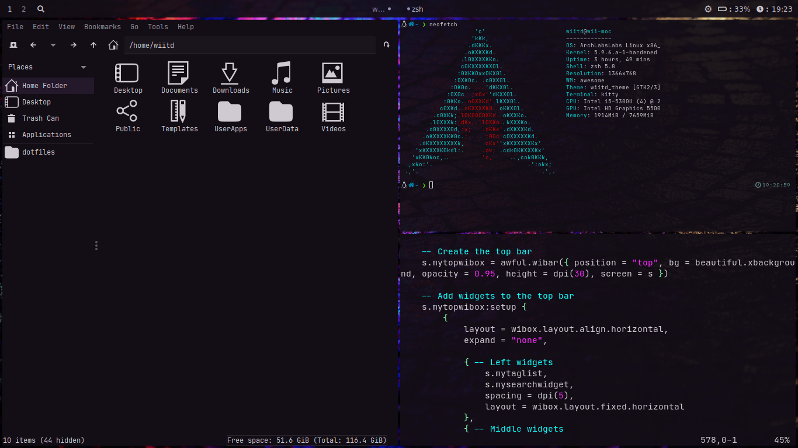

## Awesome WM config files

Based on ArchLabs Awesome theme.  

### Key bindings

 - Super + Return                        : Open terminal  
 - Super + Shift + q                     : Close window  
 - Super + Return                        : Hide window  
 - Super + Return or Left - Right arrow  : Switch tags  
 - Super + Ctrl + Arrows                 : Resize window  
 - Super + Shift + Arrows                : Change window position  

### Wallpaper

Wallpaper can be setted in theme.lua, by defoult random wallpaper is setted everytime wm is restarted.  

### Screenshots

